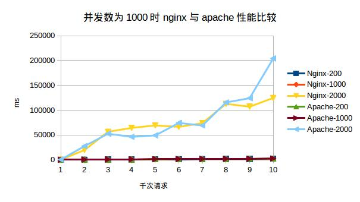

/\**
\*文件名： README.md
\*作者： 李程鹏 on Mar 16, 2018
\*描述： 帮助文档
\*/

###(一)  整体介绍
>	这是18年3月16日至19日, 实现的一个基于c语言的http压测工具. 主要压测的是本地nginx服务器和apache服务器.

>	项目包含5个模块: 命令解析,线程池,http,消息打印和代码测试. 线程池和http这2个模块为项目核心部分.

>	用户可以输入指定数量的请求数,线程数和并发数, 来模拟多台客户端向服务器发送http get请求.

###(二)  使用说明
####1. 举例
>make  &nbsp;&nbsp;编译链接项目文件

>./happyTester -h  &nbsp;&nbsp;查看帮助信息

>./happyTester -n 1000 -t 100 -c 100 -f http://localhost:98/ &nbsp;&nbsp;&nbsp;&nbsp;&nbsp;&nbsp;&nbsp;&nbsp;模拟一个请求量为1000, 线程量为100, 并发数为100的测试, 对本地98号端口(默认为80端口)的默认文件发送http get请求.

>./happyTester -n 4000 -t 400 -c 300 -f http://localhost:98/resource/happy.html &nbsp;&nbsp;&nbsp;&nbsp;&nbsp;&nbsp;&nbsp;&nbsp;模拟一个请求量为4000, 线程量为400, 并发数为300的测试, 对本地98号端口(默认为80端口)的/resource/happy.html默认文件发送http get请求.

>make clean &nbsp;&nbsp;&nbsp;&nbsp; 测试完后,删除目标文件和可执行文件

####2. 参数说明
>-n	&nbsp;&nbsp;&nbsp;请求数(-n 1000)
>-t	&nbsp;&nbsp;&nbsp;&nbsp;线程数(-t 100)
>-c	&nbsp;&nbsp;&nbsp;最多并发访问的请求数,后面跟并发数(-c 100)
>-f     &nbsp;&nbsp;&nbsp;&nbsp;要请求的文件的URL(-f http://localhost:98/index.html)
>-h	&nbsp;&nbsp;&nbsp;显示帮助信息

####3. 模块关系

###(三) 探究
####(1) 探究说明
>这里我主要探究的内容有2点: 
>(a)在tcp最大允许连接数一定的情况下, 不同数量的线程数和请求数对完成请求总时间的影响
>(b)nginx与Apache服务器的性能差异
/\*\*
>1. 一共设置3种tcp最大允许连接数{100,500,1000};
>2. 对3中tcp最大允许连接数, 测试的线程数分别为{{50,100,200},{100,500,1000},{100,1000,2000}};
>3. 对请求数, 控制数据为从1000到10000, 步长为1000.
\*/
####(2) 探究结果

####(3)结果分析
>(a) 在线程数小于并发数的时候, 服务器响应速率会很快., 且相差不大, 但当线程数是并发数的2倍或以上的时候, 服务器响应速度会10倍以上的降低!!!
>(b) 在数据量较大的时候, nginx的性能优于apache的性能, 我猜这是很多企业转向nginx的原因吧.

###(四) 部分文件说明
>(1) ./auto.sh: &nbsp;&nbsp;完成我探究的脚本,通过改变服务器端口,我分别对本地nginx和Apache服务器进行了测试, 测试结果写入到了./explores/文件夹中. 在测试时,为了减少重定向输出, 需要把./modules/thread.c 第224~251行以及154行注释掉, 把253行取消注释. 因为我设置的nginx服务器端口为98,apache端口为80, 在使用时,你需要设置成你服务器的端口.

>(2) ./doc/explores文件夹里包含我的探究结果, ./doc/explores/README是对这几个探究文件的介绍. ./doc/relations文件夹包含除测试模块外,另外4个模块的关系图

>(3) ./entry文件夹, entry.c 为项目的入口文件, gdbBeginner为执行make debug指令时的初始化调试脚本.

>(4) ./include 文件夹, 包含5个模块的头部声明文件

>(5) ./modules 文件夹, 包含命令解析,线程池,http和消息打印4个模块的具体实现

>(6) ./tester 文件夹, 包含对"(5)"中提到的4个模块的测试.
	

###(五)  项目流程

>(1) 2018年3月16日,初始化项目, 建立README.md和makefile文件
>(2) 2018年3月17日,将整个项目分解成5个模块,设计各个模块函数之间的相互调用关系
>(3)2018年3月17日,完成命令解析模块和打印模块
>(4)2018年3月18日,完成线程池模块
>(5)2018年3月19日,完成http模块.
>(6)2018年3月19日,编写自动执行脚本,完成对本地nginx和apache服务器的比较测试
>(7)2018年3月20日,用markdown语法美化帮助文档.

